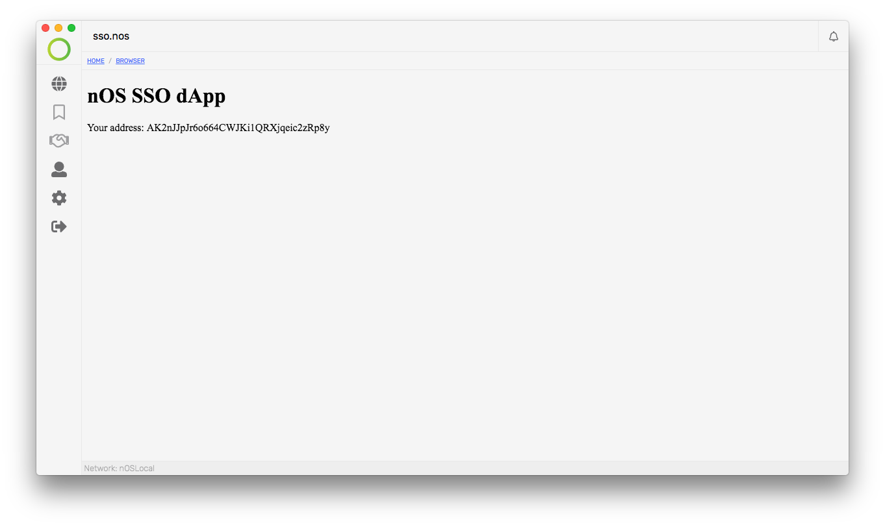

<p align="center">
   
</p>

<h1 align="center">@cryptopians/nos-sso-dapp</h1>

<p align="center">
  This is a Bookmark <strong>dApp</strong> on the <strong>nOS</strong> platform
</p>

# nOS Bookmark dApp

nOS Bookmark dApp project with Smart Contracts.

<p align="center">
   
</p>

## Getting started

To get started, please follow the [nos-local](https://github.com/nos/nos-local)
and [client](https://github.com/nos/client) documentation to get your
development environment up and running.

Follow the install/setup instructions below to import the smart contract and register
this dApp as a `.nos` domain for your client.

## Installation

Make sure you have installed all required dependencies:

```
npm install
```

Now build the frontend:

```
npm run build
```

For development we use the `npm start` command which enables the development
server located at `http://localhost:8000`.

## Setup

Within the `neo-python` prompt (wallet password is "coz") build and import the
smart contracts (the contract for this dApp is located at `contracts/nos_sso.py`):

```
open wallet neo-privnet.wallet

build /smart-contracts/contract.py
import contract /smart-contracts/contract.avm 0710 05 True False

build /smart-contracts/nos_sso.py
import contract /smart-contracts/nos_sso.avm 0710 05 True False
```

Now let's register our dApp:

```
testinvoke e60a3fa8149a853eb4dff4f6ed93c931646a9e22 RegisterDomain ['AK2nJJpJr6o664CWJKi1QRXjqeic2zRp8y', 'sso.nos', 'AK2nJJpJr6o664CWJKi1QRXjqeic2zRp8y', 'http://localhost:8000']
```

You are now ready to view your dApp in the nOS client via `nos://sso.nos`.
